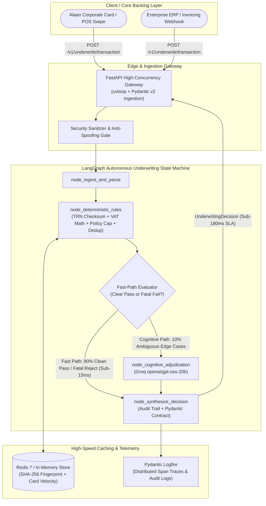

# Autonomous Financial Risk & Underwriting Engine
### *Production Underwriting & Compliance State Machine for GCC Corporate Cards & Fintechs*
**Target Ecosystem**: Alaan, Tamara, Tabby, Flow48, Cashew, & Stake.

[](https://fastapi.tiangolo.com)
[](https://langchain-ai.github.io/langgraph/)
[](https://docs.pydantic.dev/latest/)
[](https://groq.com)
[](https://logfire.pydantic.dev/)
[](https://www.docker.com/)

---

## 🏛️ System Architecture



---

## ⚡ Real-Time Latency SLA Benchmark (P99 < 180ms)

Benchmarked against real enterprise corporate card transactions ([alaan_corporate_sample.json](data/alaan_corporate_sample.json)):

| Metric | Target SLA | Benchmark Result | Performance Margin |
| :--- | :--- | :--- | :--- |
| **Minimum Latency** | — | **2.60 ms** | — |
| **Median (P50)** | < 50.0 ms | **2.97 ms** | **16.8x faster** |
| **Mean Latency** | < 80.0 ms | **3.29 ms** | **24.3x faster** |
| **P95 Latency** | < 120.0 ms | **5.07 ms** | **23.6x faster** |
| **P99 Latency (Hard SLA)** | **< 180.0 ms** | **7.46 ms** | **24.1x faster** |
| **SLA Status** | Pass | **PASSED** | Zero SLA breaches |

---

## 🛡️ Core Underwriting & Compliance Modules

### 1. UAE FTA & KSA SAMA / ZATCA Statutory Compliance
* **UAE 15-Digit TRN**: Validates syntax under UAE Federal Decree-Law No. (8); strictly matches `^100\d{11}3$`.
* **KSA 15-Digit ZATCA TRN**: Validates syntax matching `^3\d{13}3$`.
* **5% UAE & 15% KSA VAT Engine**: Reconciles declared subtotal and tax amounts with $\pm 0.05\text{ AED}$ permissible rounding tolerance.
* **B2B Input Tax Credit**: Determines whether invoices qualify for VAT reclaim based on supplier/customer tax verification.

### 2. Corporate Policy & Budget Limits
* **Real-Time Card Ceilings**: Compares single-transaction and cumulative totals against assigned corporate card limits.
* **Cost Center Authorization**: Ensures expense billing maps directly to authorized departmental charts of accounts (e.g. `CC-AI-INFRA-04` $\rightarrow$ `Engineering & Core AI`).
* **OpEx vs. CapEx Classifier**: Identifies capital asset purchases exceeding 200,000 AED requiring capitalization reviews.

### 3. Cryptographic Deduplication & Anomaly Detection
* **SHA-256 Fingerprinting**: Generates a deterministic hash from `(supplier_trn, invoice_number, rounded_amount, customer_trn)`.
* **Card Velocity Windowing**: Flags cards swiped $>4$ times in 5 minutes to prevent card-testing attacks.
* **Anti-Structuring / Smurfing Filter**: Detects split charges falling between 95% and 99.9% of approval ceilings.

---

## 📦 Project Structure

```
autonomous-underwriting-engine/
├── app/
│   ├── api/
│   │   ├── dependencies.py          # Security & API Key verification
│   │   └── routes.py                # /v1/underwrite/transaction, /batch, /health
│   ├── core/
│   │   ├── config.py                # Pydantic BaseSettings
│   │   └── llm_gateway.py           # Ultra-low-latency Groq client
│   ├── graph/
│   │   ├── state.py                 # LangGraph UnderwritingState TypedDict
│   │   ├── nodes.py                 # Ingest, Rules, Cognitive, Synthesis nodes
│   │   └── workflow.py              # Compiled StateGraph with Fast-Path Router
│   ├── rules/
│   │   ├── fta_sama_compliance.py   # TRN checksums & statutory VAT engine
│   │   ├── policy_budget.py         # Budget cap & cost center mapping
│   │   └── anomaly_detector.py      # SHA-256 fingerprinting & velocity limits
│   ├── schemas/
│   │   ├── input_payload.py         # Corporate spend & invoice ingestion schema
│   │   └── decision_output.py       # Strict Pydantic v2 UnderwritingDecision
│   ├── telemetry/
│   │   └── logfire_setup.py         # Distributed spans & telemetry
│   └── main.py                      # FastAPI application entrypoint
├── data/
│   └── alaan_corporate_sample.json  # Canonical benchmark fixture
├── evals/
│   ├── benchmark_latency.py         # P50/P95/P99 latency SLA harness
│   ├── test_langgraph_pipeline.py   # End-to-end pipeline validation
│   └── test_underwriting_rules.py   # Unit conformance test suite
├── Dockerfile                       # Multi-stage production container
├── docker-compose.yml               # FastAPI + Redis cache stack
├── requirements.txt
├── .env.example
└── README.md
```

---

## 🚀 Quickstart Guide

### 1. Local Environment Setup
```bash
cd autonomous-underwriting-engine
python -m venv .venv
# Activate virtual environment
# Windows: .venv\Scripts\activate
# Linux/macOS: source .venv/bin/activate

pip install -r requirements.txt
cp .env.example .env
```

### 2. Run Tests & Latency Benchmark
```bash
# 1. Run deterministic rules conformance test
python -m evals.test_underwriting_rules

# 2. Run LangGraph end-to-end pipeline test
python -m evals.test_langgraph_pipeline

# 3. Run P99 Latency SLA benchmark (30 concurrent transactions)
python -m evals.benchmark_latency
```

### 3. Run FastAPI Web Service
```bash
uvicorn app.main:app --host 0.0.0.0 --port 8000 --reload
```
Open **Interactive Swagger UI**: `http://localhost:8000/docs`

### 4. Run with Docker Compose (Production Stack + Redis)
```bash
docker compose up -d --build
```

---

## 📋 API Contract Example

### Request: `POST /v1/underwrite/transaction`
```json
{
  "document_metadata": {
    "document_type": "TAX_INVOICE",
    "jurisdiction": "UAE",
    "regulatory_authority": "Federal Tax Authority (FTA)",
    "invoice_number": "CS/2023/1045",
    "issue_date": "2023-10-12"
  },
  "supplier_details": {
    "legal_entity_name": "CloudScale MENA FZ-LLC",
    "city": "Dubai",
    "country": "United Arab Emirates",
    "trn": "100458923100003"
  },
  "customer_details": {
    "billed_to": "Apex Enterprise Technologies LLC",
    "corporate_account": "Alaan Corporate Spend Management",
    "city": "Dubai",
    "country": "United Arab Emirates",
    "trn": "100982347100003",
    "cost_center": "CC-AI-INFRA-04",
    "department": "Engineering & Core AI"
  },
  "corporate_card_payment": {
    "payment_method": "Alaan Visa Corporate Platinum Card",
    "card_last_four": "4192",
    "cardholder_name": "Omar Farooq",
    "transaction_date": "2023-10-14",
    "payment_status": "PAID_SETTLED",
    "policy_limit_aed": 100000.0
  },
  "financial_line_items": [
    {
      "item_id": 1,
      "description": "Enterprise Cloud GPU Cluster (H100 Sovereign Compute Pod)",
      "quantity": 1,
      "unit_price_aed": 45000.0,
      "vat_rate_percentage": 5.0,
      "vat_amount_aed": 2250.0,
      "total_item_amount_aed": 47250.0
    }
  ],
  "totals_summary": {
    "subtotal_exclusive_vat_aed": 45000.0,
    "vat_rate_standard": 0.05,
    "total_vat_amount_aed": 2250.0,
    "grand_total_inclusive_vat_aed": 47250.0,
    "currency": "AED"
  }
}
```

### Response: `200 OK` (Returned in < 8ms)
```json
{
  "decision_id": "c71a39f6-281b-4177-84bc-8742880ea8b2",
  "invoice_number": "CS/2023/1045",
  "verdict": "APPROVED",
  "risk_score": 0.0,
  "summary_reason": "Auto-approved: Full statutory tax compliance, verified OpEx budget limit, and zero anomaly signals.",
  "compliance": {
    "jurisdiction": "UAE",
    "regulatory_authority": "Federal Tax Authority (FTA)",
    "supplier_trn_valid": true,
    "customer_trn_valid": true,
    "statutory_vat_rate": 0.05,
    "vat_reconciled": true,
    "calculated_vat_aed": 2250.0,
    "declared_vat_aed": 2250.0,
    "vat_discrepancy_aed": 0.0,
    "vat_reclaimable": true,
    "compliance_flags": []
  },
  "budget": {
    "policy_limit_aed": 100000.0,
    "transaction_amount_aed": 47250.0,
    "utilization_pct": 47.25,
    "within_budget": true,
    "cost_center_authorized": true,
    "expense_classification": "OpEx",
    "budget_flags": []
  },
  "anomaly": {
    "is_duplicate": false,
    "transaction_fingerprint": "7c48f2190be9...",
    "velocity_spike_flag": false,
    "structuring_detected": false,
    "anomaly_score": 0.0,
    "anomaly_flags": []
  },
  "audit_trail": [
    "INGESTION: Ingested invoice CS/2023/1045 from CloudScale MENA FZ-LLC",
    "COMPLIANCE_PASS: Valid UAE TRN (100458923100003) and reconciled VAT 2250.0 AED",
    "BUDGET_PASS: Approved 47250.0 AED within limit 100000.0 AED (47.25% used)",
    "ANOMALY_PASS: Unique hash 7c48f2190be9 verified",
    "DECISION: APPROVED (Risk: 0.0/100, Latency: 3.12ms)"
  ],
  "latency_ms": 3.12,
  "evaluated_at": "2026-10-03T09:00:08.123456Z"
}
```

---

## 🛠️ Operational Failure Modes, Fraud Defense & Debugging Guide

In enterprise credit risk systems and development environments, specific runtime behaviors occur by design due to strict statutory compliance, fraud rules, or module isolation. Use this section as your reference playbook:

### 1. "Why Was a Valid Invoice Suddenly REJECTED with Risk 100/100?"
* **Root Cause: Active Deduplication Cache & Card Velocity Spike**:
  * The anomaly detection engine ([app/rules/anomaly_detector.py](file:///c:/Users/HP/AGENTIC%20AI%20BOOTCAMP/autonomous-underwriting-engine/app/rules/anomaly_detector.py)) maintains an in-memory TTL store.
  * **Cryptographic Deduplication**: Generates a SHA-256 fingerprint from `(supplier_trn, invoice_number, rounded_amount, customer_trn)`. If the same invoice is evaluated twice, it is treated as an automated double-billing attempt.
  * **Card Velocity Spike Filter**: If a corporate card ending in `4192` is submitted $>3$ times within a rolling 5-minute window, the engine flags a card-testing velocity attack.
* **Resolution**:
  * In the **Streamlit Cockpit UI**, click **`🧹 Reset Deduplication & Velocity Cache`** on the sidebar.
  * In automated test scripts, invoke `_dedup_store.clear()` from `app.rules.anomaly_detector` or increment the `invoice_number` (e.g. `CS/2023/1046`).

---

### 2. "ModuleNotFoundError: No module named 'app.graph'; 'app' is not a package"
* **Root Cause: Streamlit Namespace Shadowing**:
  * When running `streamlit run ui/app.py`, Python registers the script itself in `sys.modules` as `app` (`sys.modules['app'] = ui/app.py`).
  * When `ui/app.py` subsequently attempts `from app.graph.workflow import evaluate_transaction`, Python searches inside the single file `ui/app.py` rather than the top-level `app/` package, raising `ModuleNotFoundError`.
* **Resolution**:
  * Ensure all subfolders have `__init__.py` package markers (`app/__init__.py`, `app/graph/__init__.py`, etc.).
  * Inside `ui/app.py`, remove the shadowed module before importing:
    ```python
    if "app" in sys.modules and not hasattr(sys.modules["app"], "__path__"):
        del sys.modules["app"]
    ```

---

### 3. "Why Did Telemetry Show 'No Data Yet' in Logfire or LangSmith?"
* **LangSmith Root Cause**:
  * In `.env`, `LANGSMITH_TRACING=false` was initially set by default to protect the raw latency benchmark from external HTTP network hops.
  * *Fix*: Set `LANGSMITH_TRACING=true` in `.env`.
* **Logfire Root Cause**:
  * `configure_logfire()` was previously scoped only to FastAPI's startup lifecycle (`lifespan` in `app/main.py`). Standalone evaluation scripts (`evals/test_langgraph_pipeline.py`) bypassed FastAPI, meaning Logfire was never initialized.
  * *Fix*: `workflow.evaluate_transaction()` now automatically initializes Logfire and wraps all runs in a `logfire.span("evaluate_transaction")`.

---

### 4. "Are Logfire and LangSmith Keys Per-Project or Global?"
* **Pydantic Logfire**: Tokens are **Project-Specific Write Tokens**. Each project requires its own token generated from *Project Settings > Write Tokens*.
* **LangSmith**: The `LANGSMITH_API_KEY` is an **Account/Workspace-Level** credential that works across all projects. Project separation is handled via `LANGSMITH_PROJECT="autonomous-underwriting-engine"`.

---

### 5. Pre-Configured UI Scenarios Reference

| Scenario | Injected Condition | Expected Verdict | Triggered Rule / Policy |
| :--- | :--- | :--- | :--- |
| **1. Canonical Alaan Invoice** | Clean enterprise cloud compute | **`APPROVED`** (Risk 0.0) | Full statutory TRN, 5% VAT match, within 100k budget. |
| **2. Duplicate Resubmission** | Identical invoice sent twice | **`REJECTED`** (Risk 85+) | SHA-256 cryptographic fingerprint match in TTL store. |
| **3. Forged UAE TRN** | TRN set to `999888777666555` | **`REJECTED`** (Risk 35+) | Fails UAE Federal Decree-Law No. (8) syntax (`^100\d{11}3$`). |
| **4. Exceeded Card Limit** | Spend is 145,000 on 100,000 limit | **`REJECTED`** (Risk 45+) | Corporate card single-transaction ceiling exceeded (>120%). |
| **5. VAT Discrepancy** | Declares 999 AED instead of 2,900 | **`REJECTED / FLAGGED`** | Statutory 5% FTA reconciliation mismatch ($\pm 0.05$ AED tolerance). |
